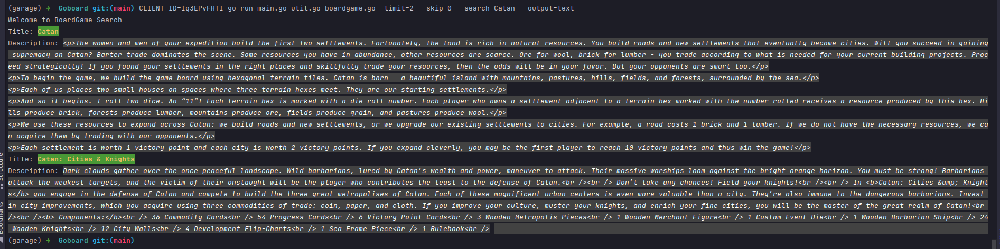

### go-board

## Agenda:
1. Lets build a CLI tool, which uses an API to search for board games.
2. Print the result in the terminal. Use colors package to highlight title/description in colors
3. Go run :
```bash
CLIENT_ID=<client_id> go run main.go util.go boardgame.go -limit=2 --skip 0 --search Catan --output=text
```
4. Build & Run:
```bash
go build -o boardgame main.go util.go boardgame.go 
CLIENT_ID=<client_id> ./boardgame -limit=2 --skip 0 --search Catan --output=text
```

